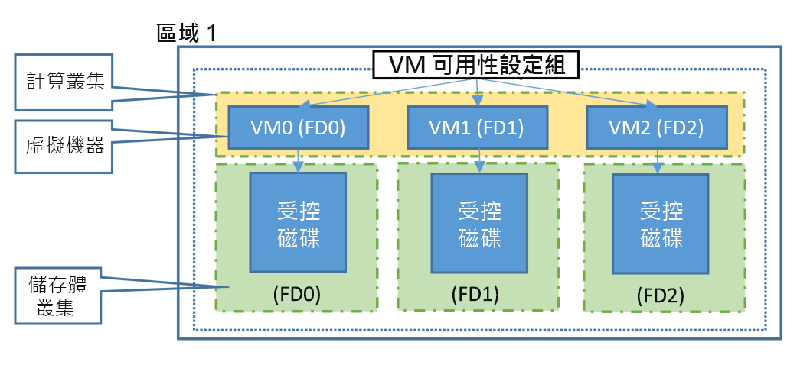

本文概述了 Azure 虛擬機器 （VM） 的可用性功能。

## 高可用性

工作負載通常分佈在不同的虛擬機器中，以獲得高輸送量、高性能，並在 VM 因更新或其他事件而受到影響時創建冗余。 

Azure 提供的選項很少，以實現高可用性。 首先，讓我們來談談基本構造。 

### 可用性區域

[可用性區域](../articles/availability-zones/az-overview.md)擴展了保持 VM 上應用程式和資料的可用性所必須的控制級別。 可用性區域是 Azure 區域內的物理獨立區域。 每個 Azure 地區支援三個可用性區域。 

每個可用性區域各有不同的電力來源、網路和冷卻系統。 將您的解決方案架構為使用區域中複寫的 VM，即可保護您的應用程式和資料免於遭受資料中心損失。 如果有個區域遭到入侵，就可以立即在另一個區域中使用複寫的應用程式和資料。 

深入了解如何在可用性區域中部署 [Windows](../articles/virtual-machines/windows/create-powershell-availability-zone.md) 或[Linux](../articles/virtual-machines/linux/create-cli-availability-zone.md) VM。

### 容錯網域

容錯網域是共用通用電源和網路交換器的基礎硬體邏輯群組，類似於內部部署資料中心內的機架。 

### 更新網域

更新網域是可以同時進行維護或重新啟動的基礎硬體邏輯群組。 

此方法可確保當 Azure 平台進行定期維護時，您的應用程式至少有一個執行個體一直保持執行中。 在維護期間，正在重新開機的更新域的順序可能不會按順序進行，但一次只重新開機一個更新域。

## 虛擬機器擴展集 

Azure 虛擬機器擴展集允許您創建和管理一組負載平衡 VM。 VM 執行個體的數目可以自動增加或減少，以因應需求或已定義的排程。 縮放集為應用程式提供高可用性，並允許您集中管理、配置和更新許多 VM。 我們建議在規模集中創建兩個或多個 VM，以提供高可用性的應用程式並滿足[99.95% Azure SLA。](https://azure.microsoft.com/support/legal/sla/virtual-machines/) 規模集本身無需支付任何費用，只需為創建的每個 VM 實例付費。 當單一 VM 是使用 [Azure 進階 SSD](https://docs.microsoft.com/azure/virtual-machines/windows/disks-types#premium-ssd) 時，非計劃性的維護事件適用 Azure SLA。 規模集中的虛擬機器可以跨多個更新域和容錯域部署，以最大限度地提高可用性和抵禦資料中心中斷以及計畫內或計畫外維護事件造成的中斷的能力。 規模集中的虛擬機器也可以部署到單個可用性區域或區域。 可用性區域部署選項可能因業務流程模式而異。

### 預覽：業務流程模式預覽
虛擬機器縮放集允許您指定業務流程模式。  使用虛擬機器縮放集業務流程模式（預覽），現在可以選擇規模集是否應協調在規模集配置模型之外顯式創建的虛擬機器，還是隱式創建的虛擬機器實例基於配置模型。 選擇 VM 業務流程模型允許您在區域或可用性區域中將顯式定義的虛擬機器分組在一起的業務流程模式。 部署在可用性區域中的虛擬機器向 VM 提供區域隔離，因為它們綁定到可用性區域邊界，並且不會受到該區域其他可用性區域中可能發生的任何故障的影響。 

|   | "編排模式"："虛擬機器"（虛擬機器）| "編排模式"："縮放集VM"（虛擬機器縮放設置VM） |
|----|----|----|
| VM 配置模型| 無。 虛擬機器組態檔在比例集模型中未定義。 | 必要。 虛擬機器組態檔填充在比例集模型中。 |
| 將新的 VM 添加到縮放集| 創建 VM 時，VM 會顯式添加到規模集中。 | VM 會根據 VM 配置模型、實例計數和自動縮放規則隱式創建並添加到縮放集。 |
| 可用性區域| 在一個可用性區域中支援區域部署或 VM| 支援區域部署或多個可用區域;可以定義區域平衡策略 |
| 容錯網域| 可以定義容錯域計數。 2 或 3 基於區域支援，5 個用於可用區域。 分配的 VM 容錯域將保留 VM 生命週期，包括取消分配和重新開機。 | 可以為非區域部署定義 1、2 或 3 個容錯域，為可用性區域部署定義 5 個容錯域。 分配的 VM 故障域不會保留 VM 生命週期，虛擬機器在分配時分配了一個容錯域。 |
| 更新網域| N/A。 更新域將自動映射到容錯域| N/A。 更新域將自動映射到容錯域 |

**故障域和更新域**

虛擬機器規模集通過對齊容錯域和更新域來簡化高可用性設計。 您只需要為比例集定義容錯域計數。 縮放集可用的容錯域數可能因區域而異。 請參閱[管理 Azure 中的虛擬機器的可用性](https://docs.microsoft.com/azure/virtual-machines/windows/manage-availability)。

## 可用性設定組
可用性設定組是資料中心內 VM 的邏輯群組，可讓 Azure 了解您應用程式的建置方式，以提供備援和可用性。 建議您在可用性設定組內建立兩個或多個 VM，以提供具高可用性的應用程式，以及符合 [99.95% Azure SLA](https://azure.microsoft.com/support/legal/sla/virtual-machines/)。 可用性設定組本身不需要任何成本，您只需針對您建立的每個 VM 執行個體支付費用。 當單一 VM 是使用 [Azure 進階 SSD](../articles/virtual-machines/windows/disks-types.md#premium-ssd) 時，非計劃性的維護事件適用 Azure SLA。

在可用性集中，VM 會自動分佈在這些容錯域中。 此方法可限制潛在實體硬體錯誤、網路中斷或電源中斷的影響。

若 VM 使用 [Azure 受控磁碟](../articles/virtual-machines/windows/faq-for-disks.md)，VM 會在使用受管理的可用性設定組時配合使用受控磁碟容錯網域。 此一配合行為可確保連接到 VM 的所有受控磁碟都位於相同的受控磁碟容錯網域。 

在受管理的可用性設定組中只能建立使用受控磁碟的 VM。 受控磁碟容錯網域數目會依區域而異，每個區域會有兩個或三個受控磁碟容錯網域。 閱讀更多適用於 [Linux VM](../articles/virtual-machines/linux/manage-availability.md?#use-managed-disks-for-vms-in-an-availability-set) 或 [Windows VM](../articles/virtual-machines/windows/manage-availability.md?#use-managed-disks-for-vms-in-an-availability-set) 的這些受控磁碟容錯網域相關資訊。

可用性集中的 VM 也會在更新域之間自動分發。 

## 後續步驟
您現在可以開始使用這些可用性和備援功能來建置 Azure 環境。 如需最佳作法資訊，請參閱 [Azure 可用性最佳作法](/azure/architecture/checklist/resiliency-per-service)。

