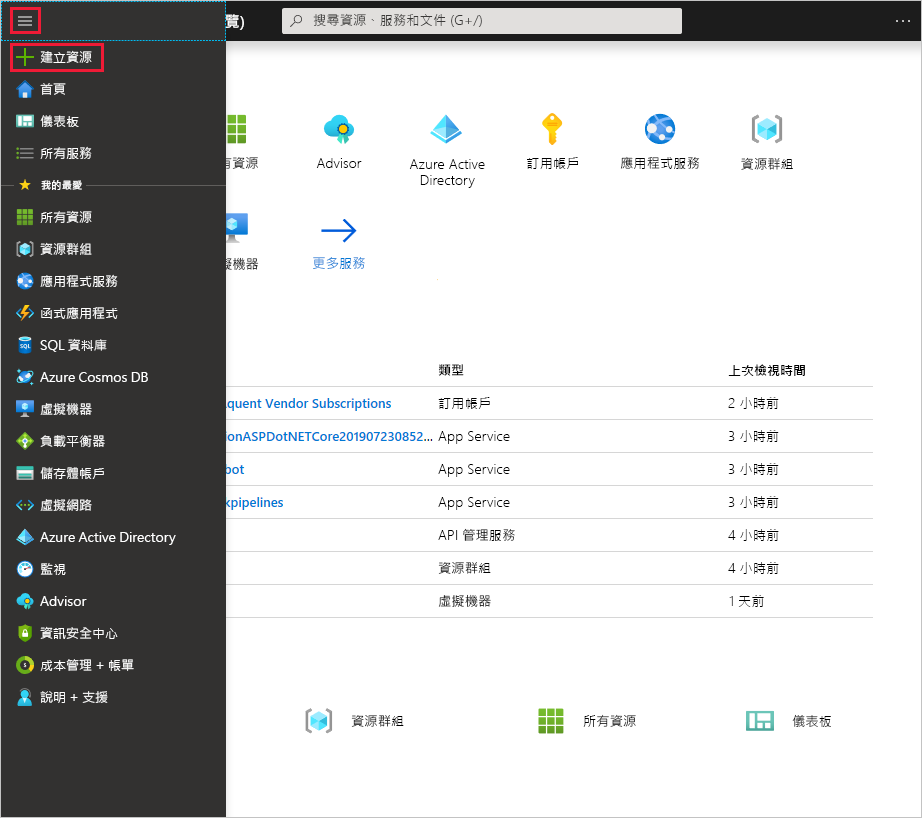

1. 從 [Azure 入口網站](https://portal.azure.com)功能表選取 [建立資源]。 

   
2. 在 [搜尋 Marketplace] 欄位中，輸入「虛擬網路閘道」。 在搜尋傳回的結果中找出**虛擬網路閘道**，然後選取該項目。 在 [虛擬網路閘道] 頁面上，選取 [建立]。 這會開啟 [建立虛擬網路閘道]**** 頁面。
3. 在 [基本] 索引標籤中，填入虛擬網路閘道的值。

   ![[建立虛擬網路閘道] 頁面欄位](./media/vpn-gateway-add-gw-rm-portal-include/gateway1.png "[建立虛擬網路閘道] 頁面欄位")

   ![[建立虛擬網路閘道] 頁面欄位](./media/vpn-gateway-add-gw-rm-portal-include/gateway2.png "[建立虛擬網路閘道] 頁面欄位")

   **專案詳細資料**

   - 訂用帳戶：從下拉式清單選取您想要使用的訂用帳戶。
   - **資源群組**：當您在此頁面上選取您的虛擬網路時，會自動填入此設定。

   **執行個體詳細資料**

   - **名稱**：為您的閘道命名。 為您的閘道命名與為閘道子網路命名不同。 這是您要建立之閘道物件的名稱。
   - **區域**：選取您要在其中建立此資源的區域。 閘道的區域必須與虛擬網路相同。
   - 閘道類型****︰選取 [VPN]****。 VPN 閘道使用 **VPN** 虛擬網路閘道類型。
   - **VPN 類型**：選取針對您的組態指定的 VPN 類型。 大部分組態需要路由式 VPN 類型。
   - **SKU**︰從下拉式清單中選取閘道 SKU。 下拉式清單中所列的 SKU 取決於您選取的 VPN 類型。 如需閘道 SKU 的詳細資訊，請參閱[閘道 SKU](../articles/vpn-gateway/vpn-gateway-about-vpn-gateway-settings.md#gwsku)。
   - **世代**：如需 VPN 閘道世代的詳細資訊，請參閱[閘道 SKU](../articles/vpn-gateway/vpn-gateway-about-vpngateways.md#gwsku)。
   - **虛擬網路**：從下拉式清單選擇您要新增此閘道的虛擬網路。
   - **閘道子網路位址範圍**︰只有當您的 VNet 沒有閘道子網時，才會顯示此欄位。 可行時，請將範圍設為 /27 以上 (/26、/25 等等)。 我們不建議您建立小於 /28 的範圍。 如果您已經有閘道子網路，您可以藉由瀏覽至您的虛擬網路來檢視 GatewaySubnet 詳細資料。 按一下 [子網路] 以檢視範圍。 如果您想要變更範圍，可以刪除並重新建立 GatewaySubnet。

   **公用 IP 位址**：此設定可指定會與 VPN 閘道建立關聯的公用 IP 位址物件。 建立 VPN 閘道時，系統會將公用 IP 位址動態指派給此物件。 公用 IP 位址只會在刪除或重新建立閘道時變更。 它不會因為重新調整、重設或 VPN 閘道的其他內部維護/升級而變更。

     - **公用 IP 位址**：將 [新建] 保持選取。
     - **公用 IP 位址名稱**：在文字方塊中，輸入公用 IP 位址執行個體的名稱。
     - **指派**：VPN 閘道僅支援「動態」。

   **主動-主動模式**：只有當您要建立「主動-主動」閘道設定時，才選取 [啟用主動 - 主動模式]。 否則，請不要選取此設定。

   將 [設定 BGP ASN]**** 保持未選取 (除非您的設定特別需要此設定)。 如果您需要此設定，預設的 ASN 為 65515，但這可以變更。
4. 選取 [檢閱 + 建立] 以執行驗證。 驗證通過後，選取 [建立] 以部署 VPN 閘道。 要完整建立和部署閘道，最多可能需要 45 分鐘的時間。 您可以在閘道的 [概觀] 頁面上看到部署狀態。

建立閘道之後，您可以查看入口網站中的虛擬網路，來檢視已指派給閘道的 IP 位址。 閘道會顯示為已連接的裝置。
