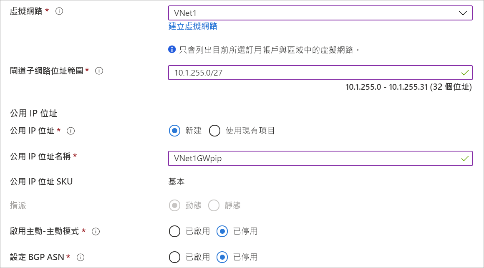

1. 在[Azure 門戶](https://portal.azure.com)功能表中，選擇 **"創建資源**"。 

   
2. 在 **"搜索市場"** 欄位中，鍵入"虛擬網路閘道"。 在搜索返回中查找**虛擬網路閘道**並選擇條目。 在**虛擬網路閘道**頁上，選擇 **"創建**"。 這會開啟 [建立虛擬網路閘道]**** 頁面。
3. 在 **"基本"** 選項卡上，填寫虛擬網路閘道的值。

   

   

   **專案詳情**

   - **訂閱**：從下拉清單中選擇要使用的訂閱。
   - **資源組**：當您在此頁面上選擇虛擬網路時，此設置將自動填滿。

   **實例詳細資訊**

   - **名稱**：為您的閘道命名。 命名閘道與命名閘道子網不同。 這是您要建立之閘道物件的名稱。
   - **區域**：選擇要在其中創建此資源的區域。 閘道的區域必須與虛擬網路相同。
   - 閘道類型****︰選取 [VPN]****。 VPN 閘道使用 **VPN** 虛擬網路閘道類型。
   - **VPN 類型**：選取針對您的組態指定的 VPN 類型。 大部分組態需要路由式 VPN 類型。
   - **SKU**︰從下拉式清單中選取閘道 SKU。 下拉式清單中所列的 SKU 取決於您選取的 VPN 類型。 如需閘道 SKU 的詳細資訊，請參閱[閘道 SKU](../articles/vpn-gateway/vpn-gateway-about-vpn-gateway-settings.md#gwsku)。
   - **生成**： 有關 VPN 閘道生成的資訊，請參閱[閘道 SKU](../articles/vpn-gateway/vpn-gateway-about-vpngateways.md#gwsku)。
   - **虛擬網路**：從下拉清單中，選擇要向其添加此閘道的虛擬網路。
   - **閘道子網位址範圍**：此欄位僅在 VNet 沒有閘道子網時才出現。 如果可能，使範圍 /27 或更大 （/26，/25 等）。 我們不建議創建小於 /28 的範圍。 如果您已有閘道子網，則可以通過導航到虛擬網路來查看閘道子網詳細資訊。 按一下**子網**以查看範圍。 如果要更改範圍，可以刪除並重新創建 Gateway Subnet。

   **公用 IP 位址**：此設定可指定會與 VPN 閘道建立關聯的公用 IP 位址物件。 建立 VPN 閘道時，系統會將公用 IP 位址動態指派給此物件。 公用 IP 位址只會在刪除或重新建立閘道時變更。 它不會因為重新調整、重設或 VPN 閘道的其他內部維護/升級而變更。

     - **公共 IP 位址**：保留 **"創建新**選擇"。
     - **公共 IP 位址名稱**：在文字方塊中，鍵入公共 IP 位址實例的名稱。
     - **分配**： VPN 閘道僅支援動態。

   **活動-活動模式**：僅在創建主動-活動閘道配置時選擇**啟用活動-活動模式**。 否則，請不要選取此設定。

   將 [設定 BGP ASN]**** 保持未選取 (除非您的設定特別需要此設定)。 如果您需要此設定，預設的 ASN 為 65515，但這可以變更。
4. 選擇 **"查看 + 創建**"以運行驗證。 驗證通過後，選擇 **"創建**"以部署 VPN 閘道。 閘道最多可能需要 45 分鐘才能完全創建和部署。 您可以在閘道的"概述"頁上查看部署狀態。

建立閘道之後，您可以查看入口網站中的虛擬網路，來檢視已指派給閘道的 IP 位址。 閘道會顯示為已連接的裝置。
