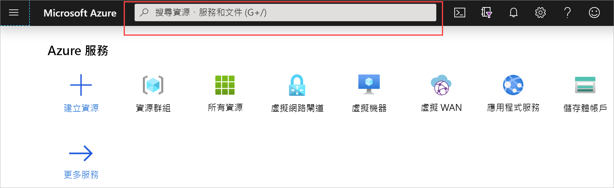

您可以使用下列步驟，透過 Resource Manager 部署模型和 Azure 入口網站建立 VNet。 如需虛擬網路的詳細資訊，請參閱[虛擬網路概觀](../articles/virtual-network/virtual-networks-overview.md)。

>[!NOTE]
>將虛擬網路當做跨單位架構的一部分使用時，請務必與您的內部部署網路系統管理員協調，以切割您可以特別用於此虛擬網路的 IP 位址範圍。 如果 VPN 連線的兩端存在重複的位址範圍，流量就會以未預期的方式路由傳送。 此外，如果您想要將此虛擬網路連線到另一個虛擬網路，位址空間不能與其他虛擬網路重迭。 請據此規劃您的網路組態。
>
>

1. 登入 [Azure 入口網站](https://portal.azure.com)。
1. 在 **[搜尋資源、服務和檔（G +/）**] 中，輸入*虛擬網路*。

   
1. 從**Marketplace**結果中選取 [**虛擬網路**]。

   
1. 在 [**虛擬網路**] 頁面上，選取 [**建立**]。

   ![[虛擬網路] 頁面](./media/vpn-gateway-basic-vnet-rm-portal-include/vnet-click-create.png "選取 [建立]")
1. 選取 [**建立**] 之後，[**建立虛擬網路**] 頁面隨即開啟。
1. 在 [**基本**] 索引標籤上，設定**專案詳細資料**和**實例詳細資料**VNet 設定。

   [![基本]](./media/vpn-gateway-basic-vnet-rm-portal-include/basics.png "[基本] 索引標籤")索引標籤當您填寫欄位時，當您在欄位中輸入的字元經過驗證時，您會看到綠色的核取記號。 系統會自動填寫某些值，您可使用自己的值加以取代：

   - **訂用帳戶**：確認列出的訂用帳戶是否正確。 您可以使用下拉式清單變更訂用帳戶。
   - **資源群組**：選取現有的資源群組，或按一下 [**建立新**的] 來建立一個新的。 如需資源群組的詳細資訊，請參閱[Azure Resource Manager 總覽](../articles/azure-resource-manager/management/overview.md#resource-groups)。
   - **名稱**：輸入虛擬網路的名稱。
   - **區域**：選取 VNet 的位置。 此位置會決定您部署到此 VNet 的資源存留的位置。

1. 在 [ **IP 位址**] 索引標籤上，設定值。 下列範例中所示的值是供示範之用。 根據您所需的設定來調整這些值。

   ![[IP 位址] 索引標籤](./media/vpn-gateway-basic-vnet-rm-portal-include/addresses.png "[IP 位址] 索引標籤")  
   - **IPv4 位址空間**：根據預設，系統會自動建立位址空間。 您可以按一下位址空間來調整它，以反映您自己的值。 您也可以新增其他位址空間。
   - **Ipv6**：如果您的設定需要 ipv6 位址空間，請選取 [**新增 IPv6 位址空間**] 方塊以輸入該資訊。
   - **子網**：如果您使用預設的位址空間，則會自動建立預設子網。 如果您變更位址空間，則需要新增子網。 選取 [ **+ 新增子網**] 以開啟 [**新增子網**] 視窗。 設定下列設定，然後選取 [**新增**] 以新增值：
      - **子網名稱**：在此範例中，我們將子網「前端」命名為。
      - **子網位址範圍**：此子網的位址範圍。

1. 在 [**安全性**] 索引標籤上，保留預設值：

   - **DDos 保護**：基本
   - **防火牆**：已停用
1. 選取 [**審查 + 建立**] 以驗證虛擬網路設定。
1. 在驗證設定之後，請選取 [**建立**]。
