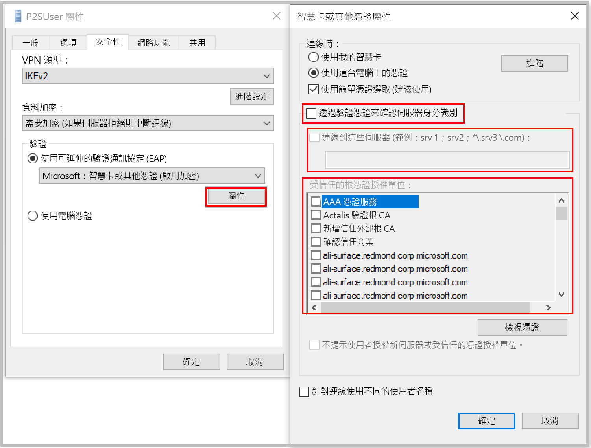

[!INCLUDE [P2S FAQ All](vpn-gateway-faq-p2s-all-include.md)]

### 如果在使用證書身份驗證連接時收到證書不匹配，該怎麼辦？

取消選中 **"通過驗證憑證驗證服務器的身份"，** 或在手動創建設定檔時**添加伺服器 FQDN 以及證書**。 可以通過從命令提示符運行**rasphone**並從下拉清單中選取設定檔來執行此操作。

通常不建議繞過伺服器標識驗證，但使用 Azure 證書身份驗證時，在 VPN 隧道協定 （IKEv2/SSTP） 和 EAP 協定中使用相同的證書用於伺服器驗證。 由於伺服器憑證和 FQDN 已通過 VPN 隧道協定驗證，因此在 EAP 中再次驗證相同是多餘的。

### 我能否使用自己的內部 PKI 根 CA 為點對點連接生成證書？

是。 先前只能使用自我簽署的根憑證。 您仍然可以上傳 20 個根憑證。

### 是否可以使用 Azure 金鑰保存庫的證書？

否。

### 我可以使用哪些工具來建立憑證？

您可以使用 Enterprise PKI 解決方案 (您的內部 PKI)、Azure PowerShell、MakeCert 和 OpenSSL。

### 是否有憑證設定及參數的指示？

* **內部 PKI/Enterprise PKI 解決方案：** 請參閱步驟來[產生憑證](../articles/vpn-gateway/vpn-gateway-howto-point-to-site-resource-manager-portal.md#generatecert)。

* **Azure PowerShell：** 請參閱 [Azure PowerShell](../articles/vpn-gateway/vpn-gateway-certificates-point-to-site.md) 文章以了解步驟。

* **MakeCert：** 請參閱 [MakeCert](../articles/vpn-gateway/vpn-gateway-certificates-point-to-site-makecert.md) 文章以了解步驟。

* **Openssl：** 

    * 匯出憑證時，請務必將根憑證轉換為 Base64。

    * 針對用戶端憑證：

      * 建立私密金鑰時，請將長度指定為 4096。
      * 建立憑證時，針對 -extensions** 參數，請指定 usr_cert**。
